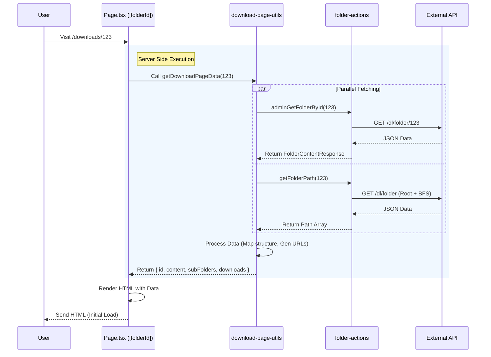

# Project Data Flow Architecture

เอกสารฉบับนี้อธิบาย **Data Flow (การไหลของข้อมูล)** ภายในโปรเจกต์ CAD Resource Center โดยเน้นที่สถาปัตยกรรมแบบ **Next.js App Router** ที่ทำหน้าที่เชื่อมต่อกับ **External REST API**

## 1. High-Level Architecture
โปรเจกต์นี้ใช้สถาปัตยกรรมแบบ **Server-Side Rendering (SSR) with Server Actions** โดยมีลักษณะการทำงานดังนี้:

*   **Frontend (Next.js)**: ทำหน้าที่เป็นทั้ง UI Renderer และ Server-Side Proxy ที่คุยกับ Backend
*   **Backend (External API)**: ให้บริการข้อมูลผ่าน RESTful API (`process.env.API_URL`)
*   **Authentication**: ใช้ Clerk (Middleware) ในการจัดการ Session เบื้องต้น และส่ง Token ไปยัง API

```mermaid
graph TD
    User[User / Client Browser]
    
    subgraph "Next.js Server (App Router)"
        Page[Server Page / Layout]
        Action[Server Action / Utils]
        Middleware[Middleware (Clerk)]
    end
    
    subgraph "External Systems"
        API[External Backend API]
        DB[(Database)]
    end

    User --"1. Request URL"--> Middleware
    Middleware --"2. Validates Session"--> Page
    Page --"3. Calls Data Util"--> Action
    Action --"4. Fetch (w/ Bearer Token)"--> API
    API --"5. Query Data"--> DB
    DB --"6. Return Data"--> API
    API --"7. JSON Response"--> Action
    Action --"8. Typed Data"--> Page
    Page --"9. HTML + Hydration Data"--> User
```

---

## 2. Example: Downloads Feature Data Flow
ตัวอย่างเจาะลึกการไหลของข้อมูลในฟีเจอร์ **Downloads** (เช่น เมื่อผู้ใช้เข้าหน้า `/downloads/123`)

### ส่วนประกอบหลัก (Key Components)
1.  **Page**: `app/downloads/[folderId]/page.tsx` (จุดเริ่มต้น)
2.  **Utility**: `utils/download-page-utils.ts` (ตัวรวบรวมข้อมูล Parallel Fetching)
3.  **Server Action**: `actions/folder-actions.ts` (ตัวยิง API)
4.  **UI Components**: `SubFolderBadges`, `DownloadList` (ตัวแสดงผล)

### Sequence Diagram
แผนภาพลำดับการทำงานเมื่อผู้ใช้เข้าถึงหน้าโฟลเดอร์เอกสาร:



---

## 3. รายละเอียดการทำงาน (Step-by-Step)

1.  **Request**: User เรียกหน้าเว็บ `/downloads/123`.
2.  **Page Initialization**: `app/downloads/[folderId]/page.tsx` เริ่มทำงาน (เป็น Server Component).
3.  **Data Gathering**:
    *   Page เรียกฟังก์ชัน `getDownloadPageData(folderId)` จาก `utils/download-page-utils.ts`.
    *   **Optimization**: ใน `utils` มีการใช้ `Promise.all` เพื่อยิง Request ไปหา `adminGetFolderById` และ `getFolderPath` พร้อมกัน (Parallel) เพื่อลดเวลาการรอลง.
4.  **API Communication**:
    *   ไฟล์ `actions/folder-actions.ts` จะอ่าน `API_URL` และ `API_TOKEN` จาก Environment Variables.
    *   ทำการ `fetch` ไปยัง Backops API ตาม Endpoint ที่กำหนด.
    *   **Error Handling**: ถ้า API ตอบกลับไม่ OK (non-200), Action จะ throw Error ออกไปเพื่อให้ Page แสดงหน้า Error หรือ Not Found.
5.  **Data Transformation**:
    *   `utils` จะแปลงข้อมูลดิบจาก API (Raw JSON) ให้เป็น Typescript Interface ที่ UI ต้องการ (เช่น `DownloadItem`).
    *   มีการคำนวณ `backLink` (ลิงก์ย้อนกลับ) จาก Path ที่ได้มา.
6.  **Rendering**:
    *   Page ส่งข้อมูลที่พร้อมใช้ (Props) ไปยัง Client Components (`DownloadList`, `SubFolderBadges`).
    *   Next.js ส่ง HTML ที่มีข้อมูลครบถ้วนกลับไปที่ Browser ของผู้ใช้.

## 4. ข้อดีของโครงสร้างนี้
*   **Security**: API Token และ Business Logic บางส่วนอยู่บน Server (Users ไม่เห็น Token).
*   **Performance**: การ Fetching เกิดขึ้นบน Server ที่อินเทอร์เน็ตมักจะเร็วกว่า client และจัดการ Caching ได้ง่าย.
*   **SEO Friendly**: Search Engine มองเห็นข้อมูลเอกสารทันที เพราะ HTML ถูกสร้างเสร็จจาก Server (Server Side Rendering).
