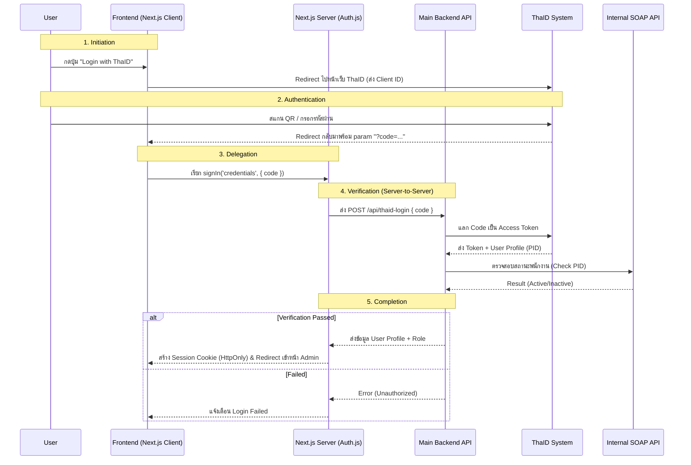

# ThaID Integration: System Workflow Summary

เอกสารนี้สรุปหลักการทำงานของระบบยืนยันตัวตน (Authentication) ที่เชื่อมต่อกับ **ThaID** โดยใช้สถาปัตยกรรมแบบ **Backend-Delegated** (ให้ Backend เป็นผู้ตรวจสอบความถูกต้อง)

## 📌 Concept: "Frontend รับ Code, Backend แลก Token"
เราออกแบบให้ **Frontend** ทำหน้าที่แค่ "พา User ไป" และ "รับของฝาก (Code) กลับมา" ส่วนเรื่องความลับและการตรวจสอบสิทธิ์ จะเกิดขึ้นที่ฝั่ง **Backend** ทั้งหมด เพื่อความปลอดภัยสูงสุด

## 🔄 Workflow Diagram

## 📝 ขั้นตอนการทำงานอย่างละเอียด

### 1. Initiation (เริ่มต้น)
*   **ที่ไหน:** หน้า `/login`
*   **การทำงาน:** User กดปุ่ม Login ระบบจะสร้าง Link ที่ระบุ `client_id` และ `redirect_uri` แล้วพา User ออกไปที่เว็บไซต์ของ ThaID

### 2. Authentication (ยืนยันตัวตน)
*   **ที่ไหน:** เว็บไซต์ ThaID (`imauth.bora.dopa.go.th`)
*   **การทำงาน:** User ทำการยืนยันตัวตนตามมาตรฐาน DOPA (IAL) เช่น สแกนหน้า หรือใส่รหัสผ่าน ระบบเราไม่ต้องยุ่งยากตรงนี้

### 3. Delegation (ส่งต่อรหัสลับ)
*   **ที่ไหน:** หน้า `/auth/callback`
*   **การทำงาน:** เมื่อ ThaID ส่ง User กลับมาพร้อม `code`, หน้าเว็บของเราจะดึง `code` นั้นแล้วส่งให้ Next.js Server ทันที ผ่านฟังก์ชัน `signIn` ของ Auth.js

### 4. Verification (ตรวจสอบสิทธิ์ - หัวใจสำคัญ ❤️)
*   **ที่ไหน:** `auth.config.ts` (Next.js) และ **Main Backend**
*   **การทำงาน:**
    1.  Next.js รับ `code` แล้วส่งต่อให้ **Main Backend** (API ที่พี่ Backend เตรียมไว้)
    2.  **Main Backend** เอา `code` ไปคุยกับ ThaID อีกทีเพื่อขอข้อมูลบัตรประชาชน (PID)
    3.  **Main Backend** เอา PID ไปเช็คกับระบบ HR (SOAP API) ว่าเป็นพนักงานจริงไหม
    4.  ถ้าผ่านหมด -> Backend ส่งข้อมูล User (ชื่อ, Role) กลับมาให้ Next.js

### 5. Completion (สร้าง Session)
*   **ที่ไหน:** Browser ของ User
*   **การทำงาน:** Auth.js ได้รับข้อมูล User จาก Backend แล้วทำการสร้าง **Encrypted HttpOnly Cookie** ฝังใน Browser ของ User ทำให้ User เข้าใช้งานหน้า `/admin` หรือ `/downloads` ได้อย่างปลอดภัย

---
**✅ ข้อดีของระบบนี้:**
1.  **Secure:** `Client Secret` และ Logic การเช็ค SOAP อยู่ที่ Backend ไม่หลุดไปหน้า Frontend แน่นอน
2.  **Standard:** ใช้มาตรฐาน OIDC และ Auth.js ในการจัดการ Session ทำให้ Maintenance ง่าย
3.  **Separation of Concerns:** Frontend ทำหน้าที่แค่ UI, Backend ทำหน้าที่ตรวจสอบ Logic ทำให้แบ่งงานกันชัดเจน
