# ThaID Integration: System Workflow Summary

เอกสารนี้สรุปหลักการทำงานของระบบยืนยันตัวตน (Authentication) ที่เชื่อมต่อกับ **ThaID** โดยใช้สถาปัตยกรรมแบบ **Backend-Delegated** (ให้ Backend เป็นผู้ตรวจสอบความถูกต้อง)

## 📌 Concept: "Frontend รับ Code, Backend แลก Token"
เราออกแบบให้ **Frontend** ทำหน้าที่แค่ "พา User ไป" และ "รับของฝาก (Code) กลับมา" ส่วนเรื่องความลับและการตรวจสอบสิทธิ์ จะเกิดขึ้นที่ฝั่ง **Backend** ทั้งหมด เพื่อความปลอดภัยสูงสุด

## 🔄 Workflow Diagram

```mermaid
sequenceDiagram
    participant User
    participant Frontend as Frontend (Next.js Client)
    participant AuthJS as Next.js Server (Auth.js)
    participant Backend as Main Backend API
    participant ThaID as ThaID System
    participant SOAP as Internal SOAP API

    Note over User, Frontend: 1. Initiation
    User->>Frontend: กดปุ่ม "Login with ThaID"
    Frontend->>ThaID: Redirect ไปหน้าเว็บ ThaID (ส่ง Client ID)

    Note over User, ThaID: 2. Authentication
    User->>ThaID: สแกน QR / กรอกรหัสผ่าน
    ThaID-->>Frontend: Redirect กลับมาพร้อม param "?code=..."

    Note over Frontend, AuthJS: 3. Delegation
    Frontend->>AuthJS: เรียก signIn('credentials', { code })
    
    Note over AuthJS, Backend: 4. Verification (Server-to-Server)
    AuthJS->>Backend: ส่ง POST /api/thaid-login { code }
    
    Backend->>ThaID: แลก Code เป็น Access Token
    ThaID-->>Backend: ส่ง Token + User Profile (PID)
    
    Backend->>SOAP: ตรวจสอบสถานะพนักงาน (Check PID)
    SOAP-->>Backend: Result (Active/Inactive)

    Note over Backend, AuthJS: 5. Completion
    Alt Verification Passed
        Backend-->>AuthJS: ส่งข้อมูล User Profile + Role
        AuthJS-->>Frontend: สร้าง Session Cookie (HttpOnly) & Redirect เข้าหน้า Admin
    Else Failed
        Backend-->>AuthJS: Error (Unauthorized)
        AuthJS-->>Frontend: แจ้งเตือน Login Failed
    End
```

## 📝 ขั้นตอนการทำงานอย่างละเอียด

### 1. Initiation (เริ่มต้น)
*   **ที่ไหน:** หน้า `/login`
*   **การทำงาน:** User กดปุ่ม Login ระบบจะสร้าง Link ที่ระบุ `client_id` และ `redirect_uri` แล้วพา User ออกไปที่เว็บไซต์ของ ThaID

### 2. Authentication (ยืนยันตัวตน)
*   **ที่ไหน:** เว็บไซต์ ThaID (`imauth.bora.dopa.go.th`)
*   **การทำงาน:** User ทำการยืนยันตัวตนตามมาตรฐาน DOPA (IAL) เช่น สแกนหน้า หรือใส่รหัสผ่าน ระบบเราไม่ต้องยุ่งยากตรงนี้

### 3. Delegation (ส่งต่อรหัสลับ)
*   **ที่ไหน:** หน้า `/auth/callback`
*   **การทำงาน:** เมื่อ ThaID ส่ง User กลับมาพร้อม `code`, หน้าเว็บของเราจะดึง `code` นั้นแล้วส่งให้ Next.js Server ทันที ผ่านฟังก์ชัน `signIn` ของ Auth.js

### 4. Verification (ตรวจสอบสิทธิ์ - หัวใจสำคัญ ❤️)
*   **ที่ไหน:** `auth.config.ts` (Next.js) และ **Main Backend**
*   **การทำงาน:**
    1.  Next.js รับ `code` แล้วส่งต่อให้ **Main Backend** (API ที่พี่ Backend เตรียมไว้)
    2.  **Main Backend** เอา `code` ไปคุยกับ ThaID อีกทีเพื่อขอข้อมูลบัตรประชาชน (PID)
    3.  **Main Backend** เอา PID ไปเช็คกับระบบ HR (SOAP API) ว่าเป็นพนักงานจริงไหม
    4.  ถ้าผ่านหมด -> Backend ส่งข้อมูล User (ชื่อ, Role) กลับมาให้ Next.js

### 5. Completion (สร้าง Session)
*   **ที่ไหน:** Browser ของ User
*   **การทำงาน:** Auth.js ได้รับข้อมูล User จาก Backend แล้วทำการสร้าง **Encrypted HttpOnly Cookie** ฝังใน Browser ของ User ทำให้ User เข้าใช้งานหน้า `/admin` หรือ `/downloads` ได้อย่างปลอดภัย

---
**✅ ข้อดีของระบบนี้:**
1.  **Secure:** `Client Secret` และ Logic การเช็ค SOAP อยู่ที่ Backend ไม่หลุดไปหน้า Frontend แน่นอน
2.  **Standard:** ใช้มาตรฐาน OIDC และ Auth.js ในการจัดการ Session ทำให้ Maintenance ง่าย
3.  **Separation of Concerns:** Frontend ทำหน้าที่แค่ UI, Backend ทำหน้าที่ตรวจสอบ Logic ทำให้แบ่งงานกันชัดเจน
